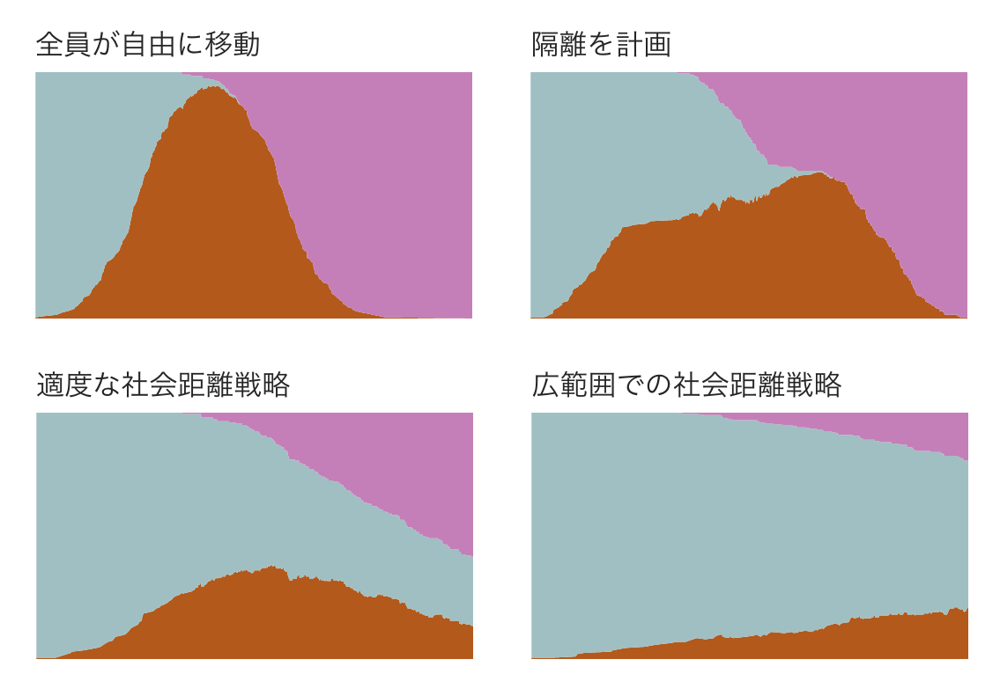

+++
author = "Yuichi Yazaki"
title = "ワシントン・ポスト史上もっとも読まれた「曲線を平らにする」記事は、なぜ伝わったのか"
slug = "wp-corona-simulation"
date = "2020-06-20"
lastmod = "2026-08-15"
categories = [
    "consume"
]
tags = [
    "COVID-19",
    "データ・ジャーナリズム",
    "シミュレーション"
]
image = "images/corona-simulation.png"
description = "ワシントン・ポスト史上もっとも読まれたコロナウイルスのシミュレーション記事について、内容、制作過程、反響、データ可視化として優れていた理由を振り返ります。"
+++

> この記事は2020年6月20日に公開した記事を、2026年8月15日に大幅に加筆・再構成したものです。

2020年3月14日、ワシントン・ポストは[「コロナウイルスなどのアウトブレイクは、なぜ急速に拡大し、どのように『曲線を平らにする』ことができるのか」](https://www.washingtonpost.com/graphics/2020/health/corona-simulation-japanese/)を公開しました。動き回る点だけで感染拡大とソーシャル・ディスタンシングの効果を示した、Harry Stevens（ハリー・スティーブンス）によるビジュアル記事です。

公開からわずか2日後、同紙のメディア担当記者Paul Farhiは、この記事が「Access Hollywood」テープを報じた記事を抜き、ワシントン・ポストのウェブサイト史上もっとも読まれた記事になったと伝えました。少なくとも2022年の[ワシントン・ポストによる人事発表](https://www.washingtonpost.com/pr/2022/10/26/harry-stevens-named-climate-environments-first-graphics-columnist/)でも、同紙史上もっとも閲覧された記事と紹介されています。

さらに歴代アクセスランキングでは、2位にほぼ2倍の差をつける突出した1位でした。アクセス数の実数は公表されていませんが、パンデミック初期に一時的に注目されたというだけでなく、同紙のウェブ史全体を通じた代表作になったことがわかります。

## 何を見せた記事だったのか

記事は、米国におけるCOVID-19感染者数の指数関数的な増加を示したあと、架空の感染症「simulitis」が人口200人の町で広がる様子をシミュレーションします。

人は色分けされた点で表されます。感染した点が未感染の点に接触すると感染が広がり、一定時間が過ぎると回復します。読者は説明を読み解く前に、ひとつの接触が連鎖し、感染者が急増していく様子を目で追えます。

<video autoplay loop muted playsinline controls>
  <source src="images/corona-simulation.mp4" type="video/mp4">
  お使いのブラウザは動画の再生に対応していません。
</video>

*ワシントン・ポストの記事をもとにした記録動画*

比較されるのは、次の4つのシナリオです。

1. **対策をしない**：全員が自由に動き、感染が急速に広がる
2. **隔離を試みる**：感染者を壁の内側に閉じ込めるが、完全な隔離に失敗すると感染が外へ広がる
3. **中程度のソーシャル・ディスタンシング**：4人に1人だけが動き続ける
4. **より強いソーシャル・ディスタンシング**：8人に1人だけが動き続ける

<figure>

<figcaption>

4つのシナリオの比較。ワシントン・ポストの記事より引用

</figcaption>

</figure>

動く点の上には、感染者数の推移がエリアチャートとして同時に描かれます。接触の連鎖と、結果として現れる曲線の形が一画面で結びつき、当時の重要な呼び掛けだった「Flatten the Curve（曲線を平らにする）」の意味を直感的に理解できる構成です。

シミュレーションは実行するたびに結果が変わります。それでも多くの場合、対策を強めるほど感染のピークは低くなります。ひとつの固定された予測値を提示するのではなく、ランダム性を残したまま、介入によって全体の傾向がどう変わるかを見せている点も重要です。

## COVID-19の予測モデルではない

このシミュレーションは、COVID-19の感染者数を予測する数理モデルではありません。感染確率、潜伏期間、年齢、行動の違い、地理、死亡など、現実の感染症を左右する多くの要因を意図的に省略しています。

記事自身も、simulitisはCOVID-19ではなく、現実を大幅に単純化したものだと明記しています。目的は未来の感染者数を当てることではなく、接触機会が減れば感染の速度を落とせるという「仕組み」を伝えることでした。

この区別は大切です。精密なモデルとして見れば粗すぎますが、説明のためのモデルとしては、その単純さが強みになっています。

## 制作過程

制作の経緯は、Stevens本人へのインタビューを掲載した[DataJournalism.com](https://datajournalism.com/read/longreads/simulating-a-pandemic)、[Poynter](https://www.poynter.org/reporting-editing/2020/how-a-blockbuster-washington-post-story-made-social-distancing-easy-to-understand/)、[National Press Club Journalism Institute](https://www.pressclubinstitute.org/from-idea-to-graphic-how-the-washington-post-visualized-the-spread-of-a-virus/)の記事からたどれます。

### 1. 出発点は、週末に作っていた「跳ねるボール」

StevensはCOVID-19が知られる以前から、JavaScriptでボールを動かし、衝突させる実験をしていました。2020年3月上旬、ワシントン・ポストのグラフィックチームが感染拡大をどう視覚化するか話し合った際に、その仕組みを応用する案を持ち込みました。

- [もとになった実験](https://bl.ocks.org/HarryStevens/f59cf33cfe5ea05adec113c64daef59b)
- [記事制作時のプロトタイプ](https://bl.ocks.org/HarryStevens/e2f49170367bbc10644ecb81f0e6dc54)

### 2. 精密な感染症モデルの再現を諦めた

当初は、ジョンズ・ホプキンス大学の研究者Lauren Gardnerが扱う感染症モデルの可視化も検討しました。しかし、実際のモデルは多くの変数と不確実性を含み、計算にも長い時間がかかります。その複雑さを短期間で正確に説明するのは難しいと判断し、COVID-19そのものを再現する方向から離れました。

ここで行ったのは、正確さを捨てたというより、問いを変えることです。「感染者は何人になるのか」ではなく、「接触のネットワークを断つと、広がり方はどう変わるのか」に焦点を絞りました。

### 3. 3回の大きな試作を重ねた

初期案は、スクロールに合わせて説明とグラフィックが切り替わるスクロール連動型の構成でした。しかし、文章がシミュレーションに重なり、読者がどこを見ればよいのかわかりにくくなりました。

別の試作では、感染した点が回復しないため、最後にはほぼすべてが感染する暗い表現になりました。チームからの指摘を受けて回復の状態を加え、現在の構成に近づけています。

Stevensは十数人からフィードバックを集め、40〜50時間ほどかけて記事を完成させました。最初のアイデアの鮮やかさだけでなく、見づらい案を捨て、他者の批評を取り込んだ反復が完成度を支えています。

### 4. D3.js、Canvas、Geometric.jsを使い分けた

実際の感染者数を示す冒頭のチャートにはD3.js、点の描画にはCanvas API、衝突判定にはGeometric.jsが使われました。多数の点をSVGで動かすのではなくCanvasに描画することで、端末上で滑らかに動くことを優先しています。

技術選択が表に出すぎず、読者は操作方法を学ばなくても、スクロールするだけで内容を理解できます。実装の高度さを、体験の単純さに変換した例といえます。

## なぜ、ここまで伝わったのか

### 抽象化の粒度がちょうどよかった

人間を点、接触を衝突、感染を色の変化に置き換えています。現実の複雑さをすべて説明しようとせず、伝えたい因果関係だけを残したため、専門知識のない読者にも仕組みが届きました。

### 「指数関数」を体験に変えた

指数関数的増加は、数字や静止画だけでは直感に反します。シミュレーションでは、最初は何も起きていないように見えた感染が、接触の連鎖によって突然加速します。読者は数式を知らなくても、増加の速度が変わる瞬間を体験できます。

### 比較がそのまま結論になっている

4つのシナリオは同じ視覚言語で並びます。変わるのは、人の動き方というひとつの条件です。読者は説明文の主張を受け入れるだけでなく、条件と結果の違いを自分で比較できます。

### 不確実性を隠さなかった

毎回違う結果になることは、弱点ではありません。単一の結果を確定的な未来として見せず、それでも繰り返し現れる傾向を示しています。シミュレーションを使う記事に必要な、確率的な見方を体験の中に組み込んでいます。

### 読者が必要としていた瞬間に公開された

記事が公開された2020年3月14日は、世界保健機関がパンデミックを宣言した3日後でした。「ソーシャル・ディスタンシング」という言葉が急速に広がる一方で、なぜ必要なのかを多くの人が理解しようとしていた時期です。

ワシントン・ポストは記事を無料公開し、日本語を含む多数の言語に翻訳しました。オバマ元大統領をはじめ、多くの著名人や読者が記事を共有しました。情報の内容、表現、公開時期、アクセスのしやすさがそろったことで、記事自体が社会的な呼び掛けの道具になりました。

## 反響と評価

Stevensのもとには、メールやSNSを通じて何百件もの反応が届きました。感染拡大への不安が、この可視化を見て和らいだという声もあったそうです。

2021年には、Harry StevensとJohn Muyskensがこの作品で[Scripps Howard Awardsの「Excellence in Innovation」](https://scripps.com/wp-content/uploads/2021/05/SHA_2021_Program_Links-1.pdf)を受賞しました。審査では、伝播の仕組みを説明した単純さと読者への集中が高く評価されています。

また、2022年に発表された[COVID-19シミュレーションにおける「点で人を表す」表現を論じた研究](https://doi.org/10.1177/20539517221098414)でも、もっとも多く閲覧されたワシントン・ポストの記事として取り上げられています。ニュース記事として消費されただけでなく、危機下のビジュアルコミュニケーションを考える研究対象にもなりました。

## 2026年に振り返って

この記事の価値は、パンデミック初期の記録だけにありません。データ可視化は、既に存在するデータをチャートにすることだけではなく、見えない仕組みをモデル化し、条件を変えた結果を比較できる形にすることでもあります。

同時に、単純なシミュレーションは現実そのものではありません。何を省略し、何を伝えるためのモデルなのかを明示して初めて、強い説明になります。

ワシントン・ポストの記事が示したのは、複雑な現象を複雑なまま見せることが正確さではない、ということです。伝えるべき因果関係を見定め、もっとも小さな表現に落とし込み、読者が自分の目で確かめられるようにする。その設計が、ひとつのビジュアル記事を同紙史上もっとも読まれた記事にしました。

## 参考資料

- [コロナウイルスなどのアウトブレイクは、なぜ急速に拡大し、どのように「曲線を平らにする」ことができるのか（日本語版）](https://www.washingtonpost.com/graphics/2020/health/corona-simulation-japanese/)
- [Why outbreaks like coronavirus spread exponentially, and how to “flatten the curve”（英語版）](https://www.washingtonpost.com/graphics/2020/world/corona-simulator/)
- [Simulating a pandemic — DataJournalism.com](https://datajournalism.com/read/longreads/simulating-a-pandemic)
- [How a blockbuster Washington Post story made ‘social distancing’ easy to understand — Poynter](https://www.poynter.org/reporting-editing/2020/how-a-blockbuster-washington-post-story-made-social-distancing-easy-to-understand/)
- [From idea to graphic — National Press Club Journalism Institute](https://www.pressclubinstitute.org/from-idea-to-graphic-how-the-washington-post-visualized-the-spread-of-a-virus/)
- [Harry Stevens named Climate & Environment’s first graphics columnist — The Washington Post](https://www.washingtonpost.com/pr/2022/10/26/harry-stevens-named-climate-environments-first-graphics-columnist/)
