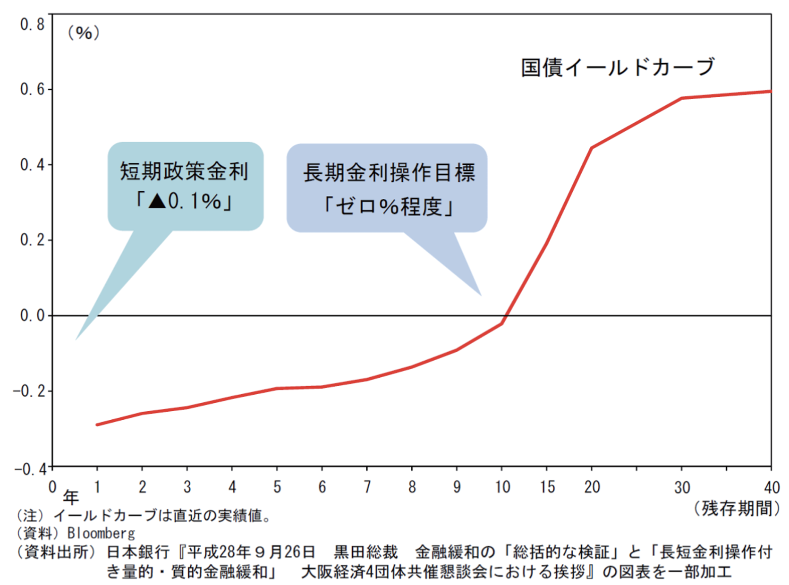

+++
author = "Yuichi Yazaki"
title = "Yield Curve"
slug = "yield-curve"
date = "2025-10-11"
categories = [
    "chart"
]
tags = [
    "",
]
image = "images/thumb_ph_vizjp.png"
+++

A yield curve connects the yields of bonds with different maturities. The X-axis usually shows maturity, and the Y-axis shows yield. It is an important financial chart for reading market expectations and the economic outlook.

<!--more-->

## Historical Background

The concept developed with bond markets and theories of the term structure of interest rates. Economists and investors use yield curves to understand expectations about inflation, monetary policy, and future growth.

## How to Read It

A normal upward-sloping curve means longer maturities have higher yields. A flat curve suggests uncertainty or transition. An inverted curve, where short-term yields exceed long-term yields, is often watched as a recession signal.

## Design Notes

- Label maturities clearly.
- Use consistent dates when comparing curves.
- Avoid too many curves in one chart.
- Consider animation or small multiples for historical change.

## Summary

The yield curve is a compact view of interest-rate expectations across maturities. Its shape is often more important than any single point.
