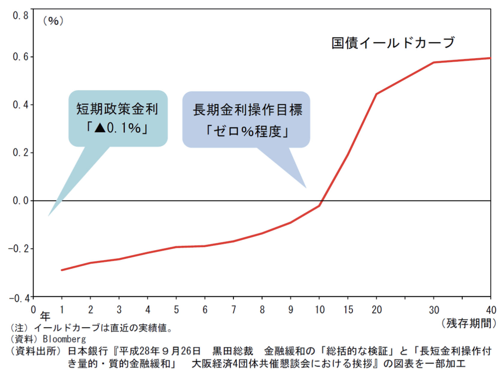

+++
author = "Yuichi Yazaki"
title = "イールド・カーブ（Yield Curve）"
slug = "yield-curve"
date = "2025-10-11"
categories = [
    "chart"
]
tags = [
    "",
]
image = "images/thumb_ph_vizjp.png"
+++

イールド・カーブ（Yield Curve）とは、国債などの **異なる満期（期間）の利回りを結んだ曲線** のことを指します。日本語では「利回り曲線」とも呼ばれます。通常、横軸に「満期（年数）」、縦軸に「利回り（％）」をとり、短期から長期までの金利の関係を視覚的に示すチャートです。

<!--more-->

イールド・カーブは **金利の期間構造（term structure of interest rates）** を表し、景気動向の予測や金融政策の判断に広く利用されます。特に国債市場では、経済全体のリスク認識を反映する重要な指標とされています。

## チャートの見方
1. **横軸（X軸）**：国債などの満期（例：3か月、2年、5年、10年、30年など）
2. **縦軸（Y軸）**：それぞれの満期に対応する利回り（％）
3. **曲線（カーブ）**：各満期の利回りを線で結んだもの

たとえば、10年物国債の利回りが2年物より高い場合、長期の金利が高い「順イールド（upward-sloping）」となります。逆に、短期の金利が長期よりも高い場合、「逆イールド（inverted）」と呼ばれ、景気後退の前兆とみなされることがあります。

## 主な形状と意味
| 形状 | 名称 | 特徴・解釈 |
|------|------|-------------|
| 上昇型 | 順イールド | 通常の形。長期金利が高く、経済成長への期待が強い。 |
| 平坦型 | フラット | 短期と長期の金利差が小さい。経済の転換期を示唆する場合がある。 |
| 下降型 | 逆イールド | 短期金利が長期金利を上回る。景気後退の予兆とされる。 |

## 背景知識
イールド・カーブは **債券価格と金利の逆相関関係** に基づいています。金利が上昇すると債券価格は下がり、金利が低下すると価格は上がります。この関係が、期間による利回り差（イールドスプレッド）として現れます。

また、中央銀行（日本では日本銀行）の **政策金利** の変化もイールド・カーブの形状に影響を与えます。たとえば政策金利が引き上げられると短期金利が上昇し、逆イールド化が進むことがあります。

米国ではFRB（連邦準備制度理事会）が発表する**「米国債利回り曲線（U.S. Treasury Yield Curve）」**が世界的に注目されています。これは経済アナリストや投資家が最も参照する指標のひとつです。

## まとめ
イールド・カーブは **金融市場の期待と経済の未来を読み解く「鏡」** のような存在です。順イールドが続く時は経済拡大期、逆イールドが発生する時は景気後退期の前触れとして注目されます。したがって、投資家や政策立案者にとって、このカーブの形状を理解することは極めて重要です。

## 参考・出典

- [U.S. Department of the Treasury — Interest Rate Statistics](https://home.treasury.gov/policy-issues/financing-the-government/interest-rate-statistics)  
- [U.S. Department of the Treasury — Treasury Yield Curve Methodology](https://home.treasury.gov/policy-issues/financing-the-government/interest-rate-statistics/treasury-yield-curve-methodology)  
- [日本銀行 — “（BOX6）国債買入れがイールドカーブに及ぼす影響”（PDF）](https://www.boj.or.jp/mopo/outlook/box/2404box6a.pdf)  
- [参議院 経済調査会 「イールドカーブとは？」（PDF）](https://www.sangiin.go.jp/japanese/annai/chousa/keizai_prism/backnumber/h28pdf/201615405.pdf)  
- [松井証券 — 「イールドカーブは何がわかる？投資への活用方法」](https://www.matsui.co.jp/stock/study/article/yield-curve/)  
- [ORIX Bank — 「イールドカーブ・コントロール（YCC）とは？」](https://www.orixbank.co.jp/column/article/292/)  
- [Sangiin（参議院）発行「経済のプリズム」シリーズ — イールドカーブ・コントロール導入時解説](https://www.sangiin.go.jp/japanese/annai/chousa/keizai_prism/backnumber/h28pdf/201615405.pdf)  